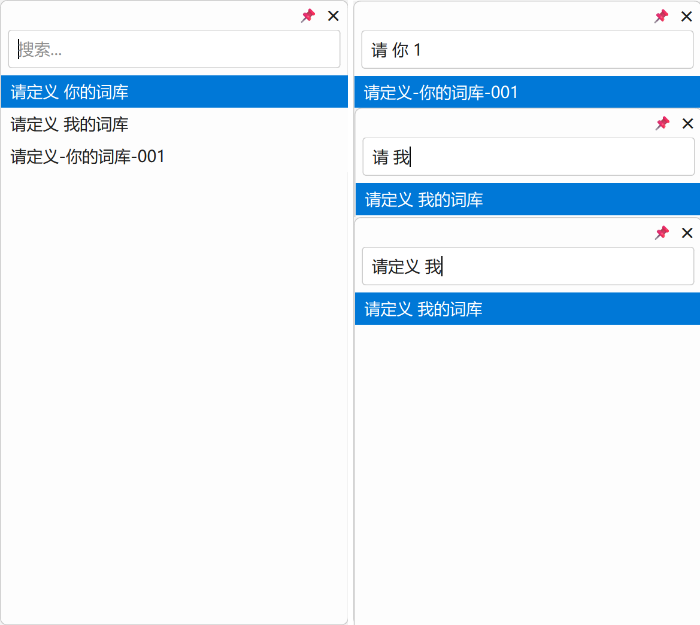

# QuickKV - 轻量级快捷输入补全工具


<p align="center">
  <a href="https://github.com/msjsc001/QuickKV/releases/latest"></a>
  <a href="https://github.com/msjsc001/QuickKV/commits/master"></a>
  <a href="https://github.com/msjsc001/QuickKV/releases"></a>
</p>

**QuickKV** 是一款轻量、高效、高度可定制的系统级快捷输入增强工具。它能让您将所有常用的文本片段（如邮箱、代码、模板、常用回复等）保存在一个简单的 Markdown 文件中，并通过全局热键 `Ctrl+Space` 在任何应用程序中即时搜索并粘贴它们，极大地提升您的输入效率。


---

## 核心特性

*   **全局热键**: 在任何地方按下 `Ctrl + Space` 即可呼出搜索框。
*   **即时搜索**: 支持关键词模糊搜索和多关键词筛选。
*   **快速粘贴**: 选中词条后，自动粘贴到您当前的光标位置。
*   **实时更新**: 直接修改词库文件，程序将自动热重载，无需重启。
*   **高度自定义**:
    *   支持**日间/夜间**双主题，并可为系统托盘菜单应用统一样式。
    *   可自由**调整窗口大小**和**设置字体大小**。
    *   支持**窗口置顶**（图钉功能），方便长时间参照。
*   **轻量运行**: 后台静默运行，仅占用极少系统资源。

---

## 用户手册

### 1. 安装与配置

**步骤一：安装依赖**

本工具使用 Python 编写，需要您先安装 Python 环境（推荐 Python 3.8+）。然后，在终端中运行以下命令安装所需库：

```bash
pip install PySide6 keyboard pyperclip
```

**步骤二：准备文件**

1.  将代码保存为 `quick_kv.py`。
2.  在 `quick_kv.py` 所在的目录下，创建一个名为 `词库.md` 的文件。如果文件不存在，程序首次启动时会自动为您创建示例。

**步骤三：编辑词库**

用任何文本编辑器打开 `词库.md`，并按照以下格式添加您的常用短语：

```markdown
- 我的个人邮箱是 my-email@example.com
- 静夜思 李白 床前明月光，疑是地上霜。
- 公司地址：XX省XX市XX区XX路XX号
- def main(): print("Hello, World!")
```

**重要提示**：每一行都必须以 `- ` (一个减号 + 一个空格) 开头。

### 2. 使用说明

1.  **启动程序**:
    在终端中，进入 `quick_kv.py` 文件所在的目录，然后运行：
    ```bash
    python quick_kv.py
    ```

2.  **呼出窗口**:
    在任何需要输入文本的地方，按下快捷键 `Ctrl + Space`。

3.  **搜索与选择**:
    *   在搜索框中输入关键词进行搜索。
    *   使用 `上/下` 方向键或鼠标选择结果。
    *   按下 `回车` 键或用鼠标**单击**词条完成选择。

4.  **管理程序**:
    在系统托盘区找到程序图标，**右键点击**可进行以下操作：
    *   **打开词库文件**: 快速编辑 `词库.md`。
    *   **打空格多词包含搜索**: 切换搜索模式。开启后，用空格分隔的多个词将作为 `AND` 条件进行搜索。
    *   **切换主题**: 在日间/夜间模式间切换。
    *   **设置字体大小**: 调整弹出窗口内的文字大小。
    *   **退出**: 关闭程序。

---

## 开发者指南

### 1. 项目架构

*   **`MainController` (主控制器)**: 应用程序的大脑，负责协调各组件、注册全局热键、监控文件变化、管理系统托盘菜单等。
*   **`SearchPopup` (搜索弹窗UI)**: 负责所有图形界面，包括无边框窗口的构建、拖拽缩放的实现、主题样式的应用等。
*   **`WordManager` (词库管理器)**: 负责词库的读取和搜索，与主逻辑解耦。
*   **`SettingsManager` (设置管理器)**: 负责 `config.ini` 配置文件的读写。
*   **`StyledItemDelegate` (样式代理)**: 负责列表项的自定义绘制，实现更精细的UI控制。

### 2. 核心技术点

*   **线程安全**: 使用 PySide6 的**信号/槽机制**，确保由 `keyboard` 库在后台线程触发的热键事件能安全地在主线程中执行UI操作。
*   **文件监控与防抖**: 使用 `QFileSystemWatcher` 监控文件变化，并结合 `QTimer` 实现“防抖”，避免文件在短时间内被多次保存时触发重复的重载操作。
*   **无边框窗口交互**: 通过重写 `mousePress/Move/ReleaseEvent` 事件实现窗口拖拽，并通过判断鼠标位置和 `_update_resize_cursor` 方法动态改变光标，实现各方向的窗口缩放。
*   **统一样式**: 通过为 `QWidget` 和 `QMenu` 应用统一的样式表（StyleSheet），确保了主窗口和系统托盘菜单在视觉风格上的一致性。

---

## 功能清单 (v1.0)

*   [x] **核心交互**
    *   [x] 全局热键 `Ctrl + Space` 呼出/关闭窗口。
    *   [x] 窗口在鼠标光标附近智能定位。
    *   [x] 实时模糊搜索和多词搜索。
    *   [x] 支持键盘 (`上/下/回车`) 和鼠标操作。
    *   [x] 选中后自动粘贴。
    *   [x] `Esc` 键清空输入或隐藏窗口。
    *   [x] 窗口置顶图钉功能。
*   [x] **窗口与UI**
    *   [x] 支持窗口拖拽和八向缩放。
    *   [x] 自动记忆并恢复窗口大小。
    *   [x] 提供日间/夜间两种主题。
    *   [x] 主窗口与托盘菜单风格统一。
*   [x] **数据与配置**
    *   [x] 词库源为可直接编辑的 `词库.md`。
    *   [x] 实时监控词库文件并自动热重载。
    *   [x] 配置保存在 `config.ini` 文件中。
*   [x] **系统托盘管理**
    *   [x] 提供系统托盘图标及右键管理菜单。
    *   [x] 菜单支持：打开词库、切换搜索模式、切换主题、设置字体、退出程序。
