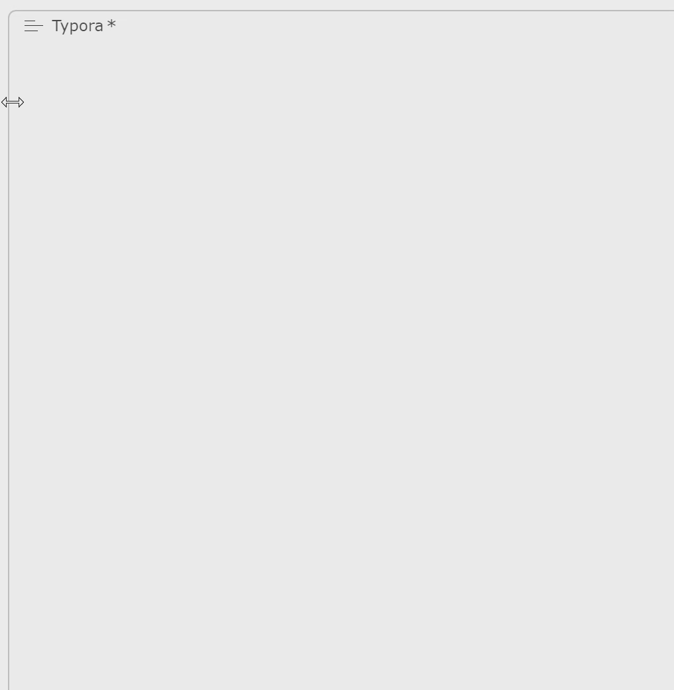

# QuickKV - 轻量级快捷输入补全工具

**QuickKV是一款轻量、高效、零门槛、易迁移、高度可定制的中文联自动补全输快捷输入增强工具**。它能让您将所有常用的文本片段（如邮箱、代码、模板、常用回复等）保存在一个简单的 Markdown 文件中，并通过全局热键 `Ctrl+Space` 在任何应用程序中即时搜索并粘贴它们，极大地提升您的输入效率。

<p align="center">
  <a href="https://github.com/msjsc001/QuickKV/releases/latest"></a>
  <a href="https://github.com/msjsc001/QuickKV/commits/master"></a>
  <a href="https://github.com/msjsc001/QuickKV/releases"></a>
</p>




---

## 核心特性

*   **全局热键**: 在任何地方按下 `Ctrl + Space` 即可呼出搜索框。
*   **智能搜索**:
    *   支持关键词模糊搜索和多关键词筛选（空格分隔）。
    *   **支持拼音首字母搜索**，输入 `qd` 即可匹配“请定”。
*   **快捷启动**: 按下 **`;`** 键可**自动复制并删除**光标前的文本，并用其内容启动搜索界面。
*   **自动排序**: 词库和搜索结果会根据中文拼音首字母自动排序，保持内容清晰有序。
*   **快速粘贴**: 选中词条后，自动粘贴到您当前的光标位置。
*   **实时更新**: 直接修改词库文件，程序将自动热重载，无需重启。
*   **高度自定义**:
    *   支持**日间/夜间**双主题。
    *   可自由**调整窗口大小**和**设置字体大小**。
    *   支持**窗口置顶**（图钉功能）。
*   **轻量运行**: 后台静默运行，仅占用极少系统资源。

---

## 用户手册

### 1. 安装与配置

**步骤一：安装依赖**

本工具使用 Python 编写，需要您先安装 Python 环境（推荐 Python 3.8+）。然后，在终端中运行以下命令安装所需库：

```bash
pip install PySide6 keyboard pyperclip pypinyin
```

**步骤二：准备文件**

1.  将代码保存为 `quick_kv.py`。
2.  在 `quick_kv.py` 所在的目录下，创建一个名为 `词库.md` 的文件。如果文件不存在，程序首次启动时会自动为您创建示例。

**步骤三：编辑词库**

用任何文本编辑器打开 `词库.md`，并按照以下格式添加您的常用短语：

```markdown
- 我的个人邮箱是 my-email@example.com
- 静夜思 李白 床前明月光，疑是地上霜。
- 公司地址：XX省XX市XX区XX路XX号
- def main(): print("Hello, World!")
```

**重要提示**：每一行都必须以 `- ` (一个减号 + 一个空格) 开头。

### 2. 使用说明

1.  **启动程序**:
    在终端中，进入 `quick_kv.py` 文件所在的目录，然后运行：
    ```bash
    python quick_kv.py
    ```

2.  **呼出窗口**:
    在任何需要输入文本的地方，按下快捷键 `Ctrl + Space`。

3.  **搜索与选择**:
    *   在搜索框中输入关键词进行搜索。
    *   使用 `上/下` 方向键或鼠标选择结果。
    *   按下 `回车` 键或用鼠标**单击**词条完成选择。

4.  **管理程序**:
    在系统托盘区找到程序图标，**右键点击**可进行以下操作：
    *   **打开词库文件**: 快速编辑 `词库.md`。
    *   **打空格多词包含搜索**: 切换多词 `AND` 搜索模式。
    *   **拼音首字母匹配**: 启用或禁用拼音首字母搜索。
    *   **；键复制查询**: 启用或禁用分号键快捷启动。
    *   **切换主题**: 在日间/夜间模式间切换。
    *   **设置字体大小**: 调整弹出窗口内的文字大小。
    *   **退出**: 关闭程序。

---

## 更新日志

### V1.0.2 (2025-07-20)
*   **新功能：拼音首字母搜索**
    *   现在可以输入每个汉字的拼音首字母进行快速匹配（例如，输入 `qd` 查找“请定”）。
    *   此功能可在系统托盘菜单中通过“拼音首字母匹配”选项动态开启或关闭（默认开启）。
    *   当与“多词搜索”同时开启时，每个以空格分隔的关键词都会同时进行文本和拼音首字母匹配。
*   **新功能：分号键快捷启动**
    *   在任何文本输入区域，按下“;”键会自动选中光标前的文本，复制并删除它，然后用复制的内容启动搜索界面。
    *   此功能旨在快速查询并替换文本，建议与“拼音首字母匹配”功能配合使用。
    *   可在系统托盘菜单中通过“；键复制查询”选项动态开启或关闭（默认开启）。
*   **修复与优化**
    *   修复了热键回调函数中的线程安全问题，确保所有UI操作都在主线程中执行，消除了 `QObject::startTimer` 错误。

### V1.0.1 (2025-07-20)
*   **核心优化：自动拼音排序**
    *   词库加载时和搜索结果显示时，都会自动按照中文拼音首字母进行排序。
    *   极大地改善了词条数量增多后的可读性和查找效率。
    *   为了性能和避免编辑冲突，词库文件的物理排序仅在程序检测到内容变更并在退出时执行。

---

## 开发者指南

### 1. 项目架构

*   **`MainController` (主控制器)**: 应用程序的大脑，负责协调各组件、注册全局热键、监控文件变化、管理系统托盘菜单等。
*   **`SearchPopup` (搜索弹窗UI)**: 负责所有图形界面，包括无边框窗口的构建、拖拽缩放的实现、主题样式的应用等。
*   **`WordManager` (词库管理器)**: 负责词库的读取、排序和搜索（包括文本、多词和拼音首字母）。
*   **`SettingsManager` (设置管理器)**: 负责 `config.ini` 配置文件的读写。
*   **`StyledItemDelegate` (样式代理)**: 负责列表项的自定义绘制，实现更精细的UI控制。

### 2. 核心技术点

*   **线程安全**: 使用 PySide6 的**信号/槽机制**，确保由 `keyboard` 库在后台线程触发的热键事件能安全地在主线程中执行UI操作。
*   **文件监控与防抖**: 使用 `QFileSystemWatcher` 监控文件变化，并结合 `QTimer` 实现“防抖”，避免文件在短时间内被多次保存时触发重复的重载操作。
*   **内容哈希校验**: 在程序退出时，通过计算词库内容的哈希值与上次保存的值进行比较，来判断是否需要执行耗时的文件重排序操作。
*   **无边框窗口交互**: 通过重写 `mousePress/Move/ReleaseEvent` 事件实现窗口拖拽，并通过判断鼠标位置和 `_update_resize_cursor` 方法动态改变光标，实现各方向的窗口缩放。

### 3. 项目结构

```
.
├── quick_kv.py         # 主程序脚本
├── 词库.md             # 用户词库文件
├── config.ini          # 配置文件
├── icon.png            # 应用程序图标
└── README.md           # 项目说明文档
```

### 4. 构建可执行文件 (Windows)

本项目使用 PyInstaller 进行打包。

1.  **安装 PyInstaller**:
    ```bash
    pip install pyinstaller
    ```

2.  **执行打包命令**:
    在项目根目录下，运行以下命令来创建一个独立的 `.exe` 文件：
    ```bash
    pyinstaller --noconsole --icon="icon.png" --add-data "icon.png;." quick_kv.py
    ```
    *   `--noconsole`: 运行时不显示命令行窗口。
    *   `--icon`: 为 `.exe` 文件和系统托盘指定图标。
    *   `--add-data`: 将图标资源打包。`词库.md` 和 `config.ini` 会在首次运行时自动生成，无需打包。

3.  **获取结果**:
    打包成功后，您可以在 `dist/quick_kv` 目录下找到生成的 `quick_kv.exe` 文件。
