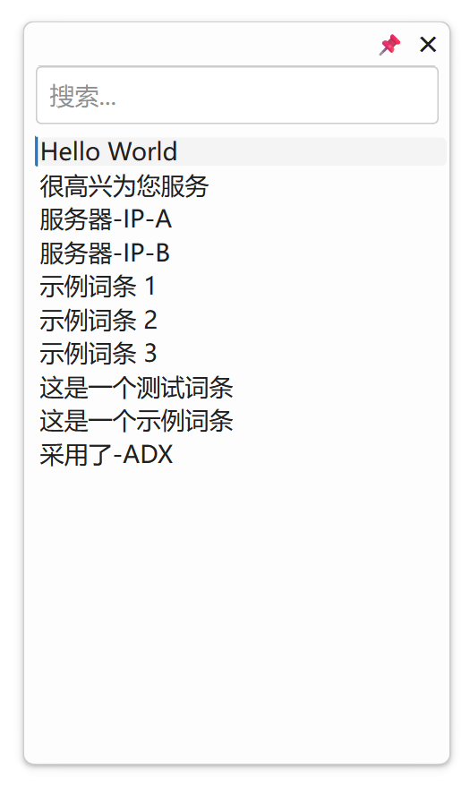

## 快捷输入补全



新写的补全软件，我发现中文软件因为输入法的自定义短语本来就比较便捷的关系，国外流行的“自动补全方式”软件国内几乎没有，国外有非常多的自动补全软件也都几乎清一色不支持中文且都比较囊肿，autohotkey之类方案我写下来也不是很理想，最后还是选择自己动手用python来实现且为开源项目。

这类软件和输入法的自定短语类同，但方词库编辑便程度、结果可读性、搜索、可迁移性上有很大差异，功能侧重还是不同。这个用于AI提示词也是非常溜！

因为更多是自用且手头时间紧暂时就不编译为exe或mac用的格式了，感兴趣的可以安全python后自行编译

### 1. 用户手册

#### 1.1 工具简介

1、本工具是一个轻量级的、系统级的快捷输入自动补全增强工具，旨在为您提供一个**“自定义短语”**和**“文本模板”**的快速调用方案。

2、它是“自动完成”(Autocomplete)或“单词补全”(Word Completion)**类工具，类似于 VSCode 的 ctrl+空格 自动补全（它不可超出 VSCode使用），或 FastKeys 的自动完成功能（它不可以中文字符为准使用）。

3、它在自动完成方面，优于系统输入法的地方是在于配置高度方便，类同项列表式观察候选，非常有利于在一些需要重复模块式输入的场景模快速调取内容输入、和快速输入一些长内容。

4、它的核心理念是：将您所有常用的文本片段（如邮箱地址、代码片段、常用回复、地址信息等）都存放在一个简单的文本文件中，然后通过一个全局快捷键，**在任何程序中都能即时搜索输入几个字就能调取粘贴它们，极大地提升您的输入效率**。


#### 1.2 功能特性

*   **全局热键**：在任何应用程序中，按下 `Ctrl + Space` 即可呼出搜索框。
*   **即时搜索**：输入任意关键词（中文、英文、拼音皆可），实时模糊搜索您的词库。
*   **快速粘贴**：选中词条后，自动粘贴到您当前的光标位置。
*   **实时更新**：您可以随时用任何文本编辑器修改您的词库文件，程序会自动加载最新内容，无需重启。
*   **高度自定义**：支持调节窗口大小、字体大小，并提供舒适的日间/夜间双主题。
*   **轻量运行**：程序在后台静默运行，仅占用极少的系统资源，通过一个系统托盘图标进行管理。

#### 1.3 安装与配置

**步骤一：安装依赖库**

本工具使用Python编写，需要您先安装Python环境（推荐 Python 3.8 或更高版本）。然后，在您的终端（命令提示符或PowerShell）中运行以下命令来安装所需的第三方库：

```bash
pip install PySide6 keyboard pyperclip
```

**步骤二：准备文件**

1.  将我们最终版本的代码保存为一个文件，例如 `quick_input.py`。
2.  **（可选）** 在 `quick_input.py` 所在的目录下，您可以自己创建一个名为 `词库.md` 的文件。如果此文件不存在，程序在第一次启动时会自动为您创建一个包含示例内容的版本。

**步骤三：编辑您的词库**

用任何文本编辑器（如记事本、VS Code、Typora等）打开 `词库.md` 文件。按照以下格式添加您自己的常用短语：

```markdown
- 我的个人邮箱是 my-email@example.com
- 静夜思 李白 床前明月光，疑是地上霜。举头望明月，低头思故乡。
- 公司地址：XX省XX市XX区XX路XX号XX大厦
- def main():
-     print("Hello, World!")
```

**重要**：每一行都必须以 `- `（一个减号 + 一个空格）开头。

#### 1.4 使用说明

1.  **启动程序**：
    在终端中，进入 `quick_input.py` 文件所在的目录，然后运行：
    ```bash
    python quick_input.py
    ```
    *在Windows上，您也可以创建一个批处理文件（.bat）来双击启动，以避免每次都打开终端。*

2.  **呼出窗口**：
    在任何您需要输入文本的地方（如记事本、浏览器地址栏、聊天窗口），按下快捷键 `Ctrl + Space`。

3.  **搜索与选择**：
    *   在弹出的搜索框中，输入关键词进行搜索。
    *   使用 `上/下` 方向键或鼠标在结果列表中进行选择。
    *   按下 `回车` 键或用鼠标**单击**词条，即可完成选择。

4.  **管理程序**：
    在屏幕右下角的系统托盘区，找到程序的图标。**右键点击**图标，会弹出管理菜单，您可以：
    *   **打开词库文件**：快速编辑您的 `词库.md`。
    *   **切换主题**：在日间/夜间模式间切换。
    *   **设置字体大小**：调整弹出窗口内的文字大小。
    *   **退出**：关闭程序。

---

### 2. 开发者指南

#### 2.1 项目架构

本项目秉持“简洁至上”的原则，代码结构清晰，主要由以下几个核心类构成：

*   **`MainController` (主控制器)**:
    *   **职责**：作为整个应用程序的“大脑”，负责协调各个组件。
    *   **核心功能**：
        *   初始化并管理 `WordManager`, `SettingsManager`, 和 `SearchPopup`。
        *   使用 `keyboard` 库注册全局热键 `Ctrl + Space`，并处理其“开关”逻辑。
        *   使用 `QFileSystemWatcher` 监控 `词库.md` 文件的变化，并通过一个带“防抖”功能的 `QTimer` 来触发词库重载。
        *   管理系统托盘菜单的创建和事件连接（如退出、打开文件、切换主题等）。

*   **`SearchPopup` (搜索弹窗UI)**:
    *   **职责**：负责所有用户可见的图形界面。
    *   **核心功能**：
        *   构建一个无边框、带阴影的现代化窗口。
        *   包含一个 `QLineEdit` (搜索框) 和一个 `QListWidget` (结果列表)。
        *   实现了窗口的拖拽、原生八向缩放（通过 `QSizeGrip`）、以及基于屏幕边缘的“智能泊靠”。
        *   通过 `apply_theme` 方法，根据配置动态生成并应用CSS样式表，实现主题和字体大小的切换。
        *   管理窗口自身的事件，如 `keyPressEvent` (处理Esc、回车等) 和 `eventFilter` (处理点击外部关闭)。

*   **`WordManager` (词库管理器)**:
    *   **职责**：专门负责词库的读取和搜索，与UI和主逻辑完全解耦。
    *   **核心功能**：
        *   `load_words()`: 从 `词库.md` 文件读取内容，并解析成一个字符串列表。如果文件不存在，则会创建一个。
        *   `find_matches()`: 提供一个简单的模糊搜索接口，根据用户输入返回匹配的词条列表。

*   **`SettingsManager` (设置管理器)**:
    *   **职责**：负责 `config.ini` 配置文件的读写。
    *   **核心功能**：
        *   使用Python内置的 `configparser` 库。
        *   `load()`: 加载配置，如果文件或配置项不存在，则提供安全的默认值。
        *   `save()`: 将程序当前的设置（窗口大小、主题、字体大小）写入文件。

#### 2.2 核心技术点解析

1.  **线程安全**: `keyboard` 库的回调函数是在一个独立的后台线程中执行的。为了确保线程安全（所有UI操作必须在Qt主线程中执行），我们使用了PySide6的**信号/槽机制**。`MainController` 在后台线程中接收到热键事件后，会 `emit` (发射) 一个信号（如 `show_popup_signal`），这个信号会安全地跨越线程边界，并触发连接在主线程中的槽函数（如 `self.popup.show_and_focus`）来执行UI操作。

2.  **文件监控与防抖(Debounce)**: 为了避免在文件被编辑器多次快速保存时，程序也进行多次无效的重载，我们实现了一个“防抖”机制。`QFileSystemWatcher` 在检测到文件变化后，并**不直接**调用 `load_words()`，而是启动（或重置）一个300毫秒的 `QTimer`。只有当300毫秒内没有新的文件变化事件发生时，这个计时器才会最终触发一次真正的词库重载。

3.  **无边框窗口的交互**:
    *   **拖拽**: 通过重写 `mousePressEvent`, `mouseMoveEvent`, `mouseReleaseEvent`，并判断鼠标是否在预设的“标题栏”区域内来实现。
    *   **缩放**: **最关键也是最稳定的实现**，是依赖 `QSizeGrip` 控件。即使它被设置为视觉上不可见，但只要它存在于窗口中，就会激活操作系统原生的、高效的八向边缘和角落缩放功能。这是比任何手动代码模拟都更优越的方案。

#### 2.3 如何续接开发

1.  **添加新配置项**:
    *   在 `SettingsManager` 的 `load()` 和 `save()` 方法中，增加对新配置项的读写。
    *   在 `config.ini` 中为它规划好 `[Section]`。
    *   在 `MainController` 或 `SearchPopup` 中添加相应的UI（如菜单项、对话框）来让用户可以修改这个配置。

2.  **修改搜索逻辑**:
    *   如果希望从模糊搜索改为更高级的搜索（如拼音首字母、正则表达式），您只需要修改 `WordManager` 中的 `find_matches()` 方法。由于它与UI解耦，所以这里的改动不会影响到程序的其他部分。

3.  **扩展数据源**:
    *   如果您想支持从 `.json` 或数据库加载词库，您可以修改 `WordManager` 的 `load_words()` 方法。甚至可以创建一个新的数据源类，并通过依赖注入的方式传入 `MainController`，以实现数据源的灵活切换。

4.  **美化UI**:
    *   所有的UI样式都集中在 `SearchPopup` 的 `apply_theme()` 方法中，通过类似CSS的 `setStyleSheet` 进行管理。您可以直接在这里修改颜色、边距、圆角等样式，或者为 `THEMES` 字典增加更多的主题配色方案。

---

### 3. 功能清单 (基于v16.0版本)

*   **核心交互**
    *   [✓] 全局热键 `Ctrl + Space` 呼出/关闭窗口。
    *   [✓] 窗口在鼠标光标附近“智能泊靠”，避免超出屏幕。
    *   [✓] 输入框自动获得焦点。
    *   [✓] 实时模糊搜索（中文、英文、拼音不区分大小写）。
    *   [✓] 支持 `上/下` 方向键和鼠标选择。
    *   [✓] 支持 `回车` 和鼠标单击确认选择。
    *   [✓] 选中后自动粘贴到前一个活动窗口。
    *   [✓] 支持 `Esc` 键关闭窗口。
    *   [✓] 支持点击窗口右上角 `✕` 按钮关闭窗口。
    *   [✓] 在输入框为空时，点击窗口外部区域可关闭窗口。

*   **窗口与UI**
    *   [✓] 支持点击窗口顶部拖拽移动。
    *   [✓] 支持拖拽窗口的所有边缘和角落进行八向缩放。
    *   [✓] 自动记忆并恢复上次使用的窗口大小。
    *   [✓] 极简UI设计，无多余图标。
    *   [✓] 提供日间/夜间两种主题模式。
    *   [✓] 夜间模式选中项颜色经过优化，清晰易读。

*   **数据与配置**
    *   [✓] 词库源为可直接编辑的 `词库.md` 文件。
    *   [✓] 实时监控词库文件变化并自动热重载。
    *   [✓] 所有配置（窗口大小、主题、字体大小）均保存在 `config.ini` 文件中。

*   **系统托盘管理**
    *   [✓] 提供系统托盘图标，用于后台运行。
    *   [✓] 右键菜单支持“打开词库文件”。
    *   [✓] 右键菜单支持“切换主题”。
    *   [✓] 右键菜单支持通过对话框“设置字体大小”。
    *   [✓] 右键菜单支持“退出”程序。